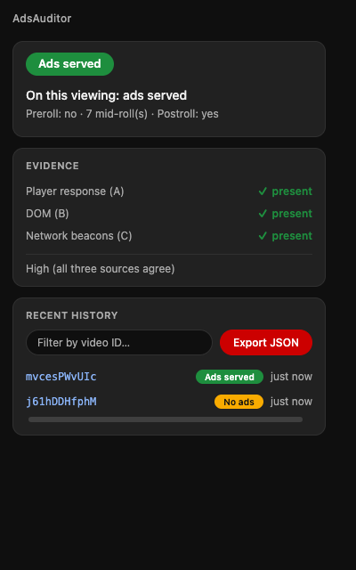

# AdsAuditor

See whether a YouTube video is actually serving ads — measured in your own browser,
kept on your own device.

[](https://github.com/Vadale/adsauditor/actions/workflows/ci.yml)
[](LICENSE)


> **Status: v0.1.0 released.** The three-source detection engine, NO_SIGNAL
> self-calibration, and the popup/badge/options UI (English source, Italian locale) are
> implemented, reviewed, and covered by unit tests, including fixtures captured from
> real player-response data during the project's validation spike. The release
> checklist was executed end-to-end in a real Chromium (driven browser, live YouTube):
> known-green, ad-free, unavailable, adblocker-active, rapid SPA navigation, and a full
> network census all pass. **The Firefox build compiles and passes the automated suite
> but has not yet been verified in a real Firefox — treat it as experimental for now.**
> Nothing is published to a store yet, and no data leaves the browser except the two
> calibration probes described below and in [`docs/PRIVACY.md`](docs/PRIVACY.md).


*The popup on a video that served ads: state, evidence per source, and qualitative
confidence — no accounts, no server, nothing sent anywhere.*

## Why

YouTube's ad-delivery decisions are a black box. Nobody outside YouTube can see, in the
moment, whether a given video is actually running ads. AdsAuditor doesn't try to guess
YouTube's internal monetization status — it **watches what the player actually does**
while you watch a video, and reports that, honestly, with its confidence and its limits
stated up front.

## What it does

- **A traffic-light badge** on the extension icon for the tab you're watching:
  green (ads served), yellow/gray (no ads observed or no signal), red (video
  unavailable).
- **A popup** with the verdict for *this viewing*, in honest language — e.g. "On this
  viewing: ads served, 2 mid-rolls" or "No ads observed on this viewing — this does NOT
  necessarily mean the video is demonetized."
- **Per-source evidence**: whether the player's own ad decision, the on-screen ad UI, and
  ad-network beacons each fired, plus a qualitative confidence line ("High (all three sources
  agree)", "Medium (two sources)", "Single source").
- **Local history**: the last 50 videos observed, searchable by video ID, kept in the
  browser's local extension storage.
- **One-click JSON export**: a button in the popup writes your local history and
  calibration status to a file on your device. Nothing is transmitted automatically.

Everything above runs, and stays, on your device. There is no account, no server, and no
telemetry in the shipped product.

## What it deliberately does NOT do

- **Does not send anything anywhere by default.** No telemetry, no accounts, no tracking,
  no identifiers beyond a purely local storage key. See
  [Privacy](#privacy) below.
- **Does not read the YouTube Studio icon** of any video, including your own — that data
  is private to the channel owner and not exposed to other browsers. AdsAuditor observes
  ad *delivery*, a strong but explicitly imperfect proxy for it.
- **Does not claim "demonetized" as fact.** The UI says "no ads observed on this
  viewing", never "this video is demonetized" or "the creator doesn't earn".
- **Does not block, modify, or inject ads**, or any other page content. It only observes
  requests and DOM state that the browser and the page already produce.
- **Does not track users.** Ever.

## How detection works

Three independent, redundant sources of evidence, cross-referenced before any verdict is
shown:

1. **Player response (source A)** — the ad-placement data YouTube's own player receives
   for the video (`adPlacements`/`adSlots`/`playerAds`): the ad *decision*, available
   even before playback.
2. **DOM signals (source B)** — the on-screen ad UI actually appearing (`ad-showing`/
   `ad-interrupting` player classes): the ad *actually playing*, and the source most
   likely to survive if YouTube moves ad insertion server-side.
3. **Network beacons (source C)** — ad-impression pings the browser fires to YouTube's
   and Google's ad infrastructure: an independent confirmation.

A **NO_SIGNAL discipline** keeps the system honest: if this browser is running an
adblocker, is on a YouTube Premium account, or hasn't yet been calibrated against a
known-monetized control video, an absence of ads is reported as "no signal", never as
"no ads" — an uncalibrated observer can't tell "this video has no ads" apart from "this
browser can't see ads". A **rewatch guard** similarly discards absence-evidence on a
video you watched in the last 24 hours, since YouTube caps how often it re-shows ads on
repeat views.

Thresholds for inferring a *limited* (yellow-icon-style) status from aggregated
observations were deliberately left **out of the client** — that kind of inference needs
many independent observers to be meaningful, which this local-only build doesn't have.
See [`docs/SPEC.md`](docs/SPEC.md) for the full detection mechanism, the state taxonomy,
and the reasoning the client currently omits.

## Privacy

The extension makes exactly two outgoing network requests — small, payload-free
self-calibration probes needed to tell "this browser can't see ads" apart from "this
video has no ads" — and nothing else. No video ID, user identifier, history, or
telemetry of any kind leaves the browser. Full detail, including the exact probe URLs,
cadence, and what's stored locally: [`docs/PRIVACY.md`](docs/PRIVACY.md).

## Sharing your observations

There is no backend and no automatic upload. If you want to contribute your local
observations to the project, use the popup's **Export JSON** button — it writes a file
in a versioned schema (`adsauditor-local-export`, currently `schemaVersion: 1`)
containing your local history and calibration status, and nothing else. Sharing that
file with the maintainer (for example by attaching it to a GitHub issue) is entirely
manual and voluntary; nothing is sent automatically at any point.

A shared, opt-in public observatory — pooling observations from many users into an
aggregated, browsable map of ad delivery across YouTube — is a **possible future
feature**, not a committed one. If it ever ships, it will be off by default, require an
explicit opt-in action, and be documented in [`docs/PRIVACY.md`](docs/PRIVACY.md) before
any code that sends data exists.

## Install

There's no store listing yet (see the status note at the top). Until then, load the
extension manually:

### From a Release zip (once one exists)

1. Download the Chrome or Firefox zip from the repo's
   [Releases](https://github.com/Vadale/adsauditor/releases) page and unzip it.
2. **Chrome/Edge**: open `chrome://extensions` (or `edge://extensions`), enable
   *Developer mode*, click *Load unpacked*, and select the unzipped folder.
3. **Firefox**: open `about:debugging#/runtime/this-firefox`, click *Load Temporary
   Add-on*, and select the `manifest.json` inside the unzipped folder. Firefox removes
   temporary add-ons on restart; reload after each browser restart until the extension
   is signed and published on AMO.

### From a local build

See [Build from source](#build-from-source) below, then load
`extension/.output/chrome-mv3` (Chrome/Edge, "Load unpacked") or
`extension/.output/firefox-mv3/manifest.json` (Firefox, "Load Temporary Add-on") the
same way as above.

## Build from source

Requirements: Node.js >= 20.12 (required by WXT), npm. Developed and verified locally
with Node v26.0.0; CI is pinned to Node 22 for reproducibility — both satisfy WXT's
`engines` requirement, so either works.

```bash
git clone https://github.com/Vadale/adsauditor.git
cd adsauditor/extension
npm install

# Development (hot-reloading, opens a temp browser profile)
npm run dev            # Chrome
npm run dev:firefox    # Firefox

# Production build, both targets
npm run build           # -> extension/.output/chrome-mv3, extension/.output/firefox-mv3
npm run zip              # -> extension/.output/*.zip, ready to load or ship

# Quality checks
npm run lint
npm run format:check
npm run typecheck
npm test
```

## Repo layout

| Path | Contents |
|---|---|
| `extension/` | The browser extension. WXT + TypeScript, Manifest V3, builds for Chrome and Firefox. The only component with real, shipping code. |
| `server/` | Reserved for a possible future shared observatory — empty, descoped 2026-07-11. Not part of the current product. |
| `dashboard/` | Reserved for a possible future shared observatory — empty, descoped 2026-07-11. Not part of the current product. |
| `spike/` | Phase 0 throwaway measurement extension + collected dataset that validated the detection signal before the extension was built. Results in `spike/RESULTS.md`. |
| `docs/` | `SPEC.md` (design reference — sections on the crowdsourced backend, dashboard, and verification are unbuilt and marked as such), `ROADMAP.md` (historical execution plan), and `PRIVACY.md` (what the extension collects today). |
| `.github/workflows/` | CI (lint/test/build on pushes to `main` and on pull requests) and Release (build + GitHub Release on `v*` tags). |

Phase 0's validation results — the measured signal thresholds that feed the classifier —
live in [`spike/RESULTS.md`](spike/RESULTS.md).

## Project docs

| Document | What it's for |
|---|---|
| [`docs/SPEC.md`](docs/SPEC.md) | Full design reference: detection mechanism, state taxonomy, privacy design. Sections on a crowdsourced backend, public dashboard, and creator verification describe a **possible future**, not shipped code — they're kept as design history and are not built. |
| [`docs/PRIVACY.md`](docs/PRIVACY.md) | Exactly what the extension collects, stores, and sends, today. |

## License

**Code** (extension, and any future server/dashboard code): [AGPL-3.0](LICENSE). Forks
that offer a network service built on this code must stay open under AGPL's network-use
clause.

There is no aggregated dataset today. If a shared, opt-in observatory ever ships and
produces one, its license will be decided and documented at that point.
